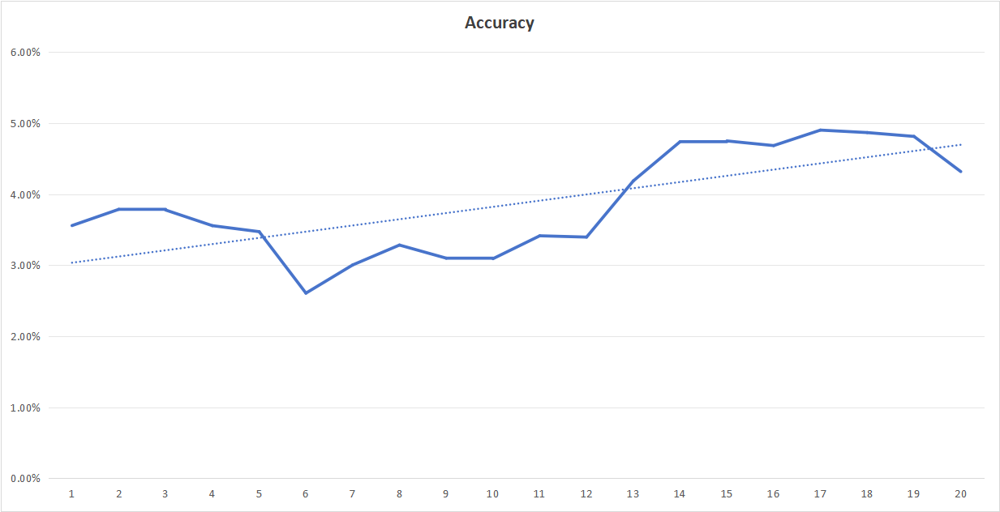

# GPS

论文[Predicting IPv4 Services Across All Ports](https://dl.acm.org/doi/abs/10.1145/3544216.3544249)中所提出的GPS系统的pandas实现。

## Usage

```bash
# 计算种子集合前10000条数据的有效率/准确率
python gps.py --seed-accuracy

# 计算由种子集合前 a 条数据所预测出的服务端口的准确率
python gps.py -a 200

# 批量测试
python test.py
```

## Result

[种子数据](https://www.dropbox.com/s/rszznd5j1f1o430/lzr_seed_april2021_filt.json.zip?dl=0U)集前500,1000,1500,...,10000条数据的预测结果的准确率：



